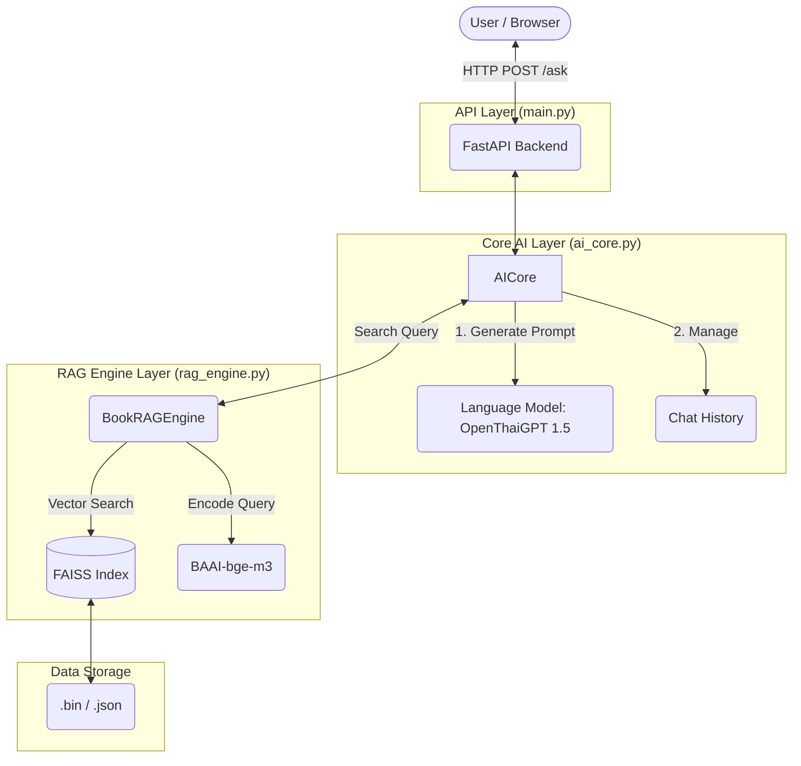

# 01 System Architecture (ภาพรวมระบบ)

ยินดีต้อนรับสู่ **OpenThaiGPT-RAG Chat**! เอกสารฉบับนี้จะพาคุณไปทำความเข้าใจโครงสร้างภาพรวมของระบบ (System Architecture) ในฐานะผู้ออกแบบระบบ (System Architect) เพื่อให้เห็นภาพการทำงานทั้งหมดก่อนเจาะลึกในส่วนอื่นๆ

---

## 1. What is OpenThaiGPT-RAG? (ภาพรวมของโปรเจกต์)

โปรเจกต์นี้คือ **Web Application AI** ที่เชื่อมต่อกับระบบ **Retrieval-Augmented Generation (RAG)** โดยทำหน้าที่เป็น "ภัณฑารักษ์ความรู้" (Knowledge Curator) ส่วนตัวของคุณ 
จุดเด่นคือการนำเอกสารส่วนตัว (เช่น หนังสือ) มารวมกับสมองของ AI (LLM) อย่าง `openthaigpt1.5-7b-instruct` เพื่อให้ AI สามารถตอบคำถามโดยอ้างอิงข้อมูลที่ถูกต้องและมีแหล่งที่มาได้

---

## 2. System Component Diagram (แผนภาพส่วนประกอบของระบบ)

สถาปัตยกรรมของโปรเจกต์นี้ถูกออกแบบมาแบบ **Modularity** (แยกส่วนการทำงานออกจากกันอย่างชัดเจน) มีโครงสร้างดังนี้:

### คำอธิบายแต่ละ Layer:
1. **Presentation/Interface Layer (`web/`)**: ส่วนติดต่อผู้ใช้ (Frontend) เป็น HTML, CSS (Tailwind) และ JavaScript (Vanilla) ส่งคำสั่งผ่าน HTTP Request
2. **API Layer (`main.py`)**: เป็นด่านหน้า (Gateway) รับและส่งต่อคำถาม ใช้ `FastAPI` เพื่อความรวดเร็วและรองรับ Asynchronous
3. **Core AI Layer (`core/ai_core.py`)**: เป็น "ผู้จัดการ" (Orchestrator) จัดการวงจรชีวิตของ AI โหลดโมเดล สร้าง Prompt และสั่งประมวลผลคำตอบ
4. **Data Access Layer (`core/rag_engine.py` & `data/`)**: เครื่องยนต์ค้นหาความรู้ ดึงข้อความจากฐานข้อมูลเวกเตอร์ (FAISS) มาเสริมตัวเลือกให้ AI

---

## 3. The Request Lifecycle (เส้นทางของข้อมูล)

เมื่อผู้ใช้พิมพ์คำถามว่า *"หนังสือ A พูดถึงเรื่องอะไร?"* เส้นทางการประมวลผล (Lifecycle) จะเป็นดังนี้:

1. **Routing (Gateway):** 
   - HTTP Request เข้ามาที่ `POST /ask` ใน `main.py`
   - FastAPI สั่งมอบหมายงานนี้ไปที่ `ai_core.generate_response()`

2. **Canned Response Check:** 
   - ระบบเช็คว่าเป็นคำทักทายพื้นฐานหรือไม่ (เช่น "สวัสดี") ถ้าใช่ ให้ตอบกลับทันที (O(1) time complexity) เพื่อประหยัดทรัพยากรการประมวลผล

3. **Knowledge Retrieval (RAG):**
   - คำถามถูกส่งไปที่ `rag_engine.search(query)`
   - โมเดล Embedder (`bge-m3`) ทำการแปลงคำถามเป็นค่าเวกเตอร์ และค้นหาใน FAISS
   - ได้ `context` (เนื้อหาในหนังสือ) และ `best_score` กลับมา

4. **Dynamic Prompting:**
   - เช็ค `best_score` หากคะแนนความเกี่ยวข้องถึงเกณฑ์ (Threshold ≥ 0.60) AI จะเปิดโหมด "ภัณฑารักษ์" และนำ Context แปะลงใน Prompt
   - หากคะแนนต่ำกว่าเกณฑ์ AI จะรันในโหมด "สนทนาทั่วไป" โดยไม่ใช้ Context

5. **LLM Generation:**
   - คำสั่งถูกห่อหุ้มเข้าไปในรูปแบบ `apply_chat_template()` รวมกับประวัติการแชท
   - ส่งขึ้นไปประมวลผลบนการ์ดจอ (GPU) ผ่านโมเดล `OpenThaiGPT`

6. **Response:**
   - ได้ผลลัพธ์ ตัดแต่งข้อความ (String manipulation) แล้วส่ง JSON กลับไปยัง Frontend

---

## 4. Separation of Concerns (SoC) Principle

การออกแบบโครงสร้างโปรเจกต์นี้ยึดมั่นใน **Separation of Concerns (SoC)**:
*   `main.py` ไม่รู้จักวิธีการโหลด VRAM หรือสร้าง Prompt มันรู้แค่การคุยกับ Web HTTP
*   `ai_core.py` ไม่รู้จักวิธีการสร้าง FAISS Index มันรู้แค่การถาม `rag_engine` เพื่อขอข้อมูล
*   `rag_engine.py` ไม่รู้จักโมเดลภาษา มันเก่งแค่เรื่องการหา "ความคล้าย" ข้อมูลแบบเวกเตอร์

**ทำไม SoC ถึงสำคัญ?**
การแยกไฟล์และงานแบบ "One file for one specific task" ทำให้ในอนาคต หากคุณต้องการเปลี่ยนจาก FastAPI ไปทำ Line Bot คุณไม่ต้องแก้ไฟล์ `ai_core.py` เลย! (Code Reusability & Maintainability)

---

**→ ขั้นตอนต่อไป:** ไปเรียนรู้เรื่องสมองกล (LLM) และการโหลด VRAM ในไฟล์ `02_language_model.md`
