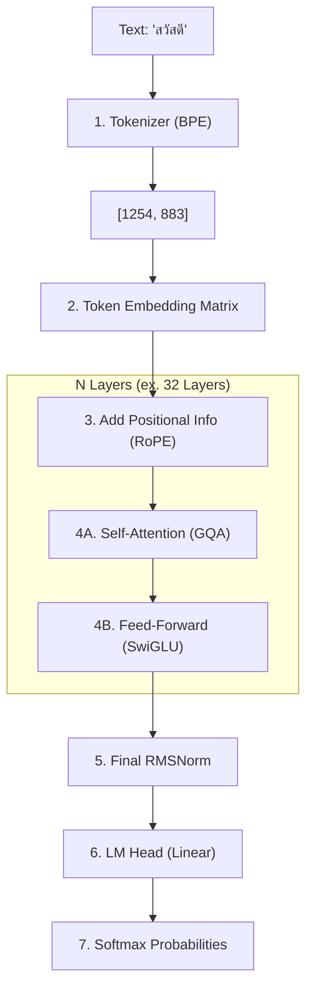

# 05 OpenThaiGPT 1.5: Under the Hood (เจาะลึกคณิตศาสตร์และสถาปัตยกรรมระดับ Paper)

เอกสารฉบับนี้ถูกเขียนขึ้นเป็นพิเศษเพื่อ **วิศวกรโครงสร้าง (AI System Architect) และนักวิจัย** ที่ต้องการเข้าใจว่าเกิดอะไรขึ้นในระดับ "เศษส่วนของตัวเลข" (Mathematical & Architectural Level) เมื่อโมเดล `openthaigpt1.5-7b-instruct` ทำงาน

คำเตือน: เอกสารนี้จะมีสมการคณิตศาสตร์ สถาปัตยกรรมฮาร์ดคอร์ และการอธิบาย Matrix Multiplication อย่างละเอียด

---

## 1. The Lineage (สายเลือดของโมเดล)

`openthaigpt1.5-7b-instruct` ไม่ได้ถูกสร้างขึ้นจากศูนย์ แต่เป็นการนำสถาปัตยกรรมของ **Qwen1.5-7B** (จาก Alibaba Cloud) มาทำการ **Continual Pre-training และ Fine-tuning** ด้วยคลังข้อมูลภาษาไทยมหาศาล

**คุณสมบัติทางสถาปัตยกรรม (Architectural Specs):**
*   **Architecture:** Transformer (Decoder-only)
*   **Parameters:** ~7.7 Billion (7.7 พันล้านตัวแปร)
*   **Hidden Size ($d$):** 4096 มิติ
*   **Attention Heads:** 32 (Query) และ 8 (Key/Value) — *ใช้ Grouped-Query Attention (GQA)*
*   **Activation Function:** SwiGLU
*   **Positional Encoding:** RoPE (Rotary Positional Embedding)

---

## 2. The Internal Pipeline (การเดินทางของตัวเลข)

เมื่อผู้ใช้พิมพ์คำถามว่า "สวัสดี" กระบวนการ 5 ขั้นตอนหลักระดับวงจรขั้วสมองจะทำงานดังนี้:

---

## 3. The Mathematics of Attention (หัวใจของการ "ตระหนักรู้")

ใน Transformer, คำแต่ละคำต้อง "แอบดู" บริบทของเพื่อนๆ รอบข้างผ่านกลไก **Self-Attention**

### 3.1 การสร้าง Q, K, V (Query, Key, Value)
สมมติให้เมทริกซ์ของคำเข้า (Input Sequence) คือ $X$ ขนาด $(L, d)$
*   $L$ = ความยาวคำ (Sequence Length)
*   $d$ = ขนาดของเวกเตอร์ (4096)

โมเดลจะเอา $X$ ไปคูณกับเมทริกซ์น้ำหนัก (Weights) $W_Q, W_K, W_V$:
$$ Q = X W_Q $$
$$ K = X W_K $$
$$ V = X W_V $$
*(เทียบง่ายๆ: Q = ฉันกำลังมองหาอะไร?, K = ฉันคือใคร/มีข้อมูลอะไร?, V = ถ้าฉันตรงกับสิ่งที่แกหา เอาความหมายนี้ไป)*

### 3.2 The Attention Equation (สมการเปลี่ยนโลก)
เมื่อเกิดการค้นหาความเข้ากันได้ จะเกิดสมการ:
$$ \text{Attention}(Q, K, V) = \text{Softmax}\left(\frac{Q K^T}{\sqrt{d_k}}\right) V $$

**อธิบายทีละขั้น (Step-by-step Math):**
1.  **$Q K^T$ (Dot Product):** จับ Query และ Key มาคูณเมทริกซ์สลับแกน (Transpose) ผลลัพธ์คือ **Attention Scores** (ขนาด $L \times L$) ที่บอกว่าคำไหนเชื่อมโยงกับคำไหนกี่เปอร์เซ็นต์
2.  **$\frac{1}{\sqrt{d_k}}$ (Scaling):** หารด้วยรากที่สองของขนาดมิติ (เช่น $\sqrt{128}$) เพื่อป้องกันไม่ให้ค่า Score พุ่งทะลุขอบเขตจนทำให้ Softmax พัง (Vanishing/Exploding Gradients)
3.  **$\text{Softmax}$:** บังคับให้คะแนนทุกแถวรวมกันได้กะรัตละ 1 (100%) เปลี่ยนค่าดิบให้กลายเป็น "ความน่าจะเป็นทางสถิติ"
4.  **$\times V$:** นำเปอร์เซ็นต์ที่ได้ ไปสกัดเอา "เนื้อความหมาย (Value)" ลากมารวมกัน เกิดเป็นเวกเตอร์ใหม่ที่แฝงบริบทของคำรอบข้างครบถ้วน

---

## 4. GQA: Grouped-Query Attention (นวัตกรรมประหยัด VRAM)

ใน Transformer ยุคเก่า (Multi-Head Attention: MHA) Q, K, V จะมีจำนวนหัว (Heads) เท่ากัน เช่น 32 หัว ทำให้เวลาเก็บ KV Cache (ข้อมูลจำแชทเก่า) ต้องใช้ VRAM เป็นมหาศาล

OpenThaiGPT 1.5 ใช้ **Grouped-Query Attention (GQA)**:
*   มี Query 32 Heads
*   แต่มี Key, Value แค่ 8 Heads
*   **อัตราส่วน 4:1** (Query 4 หัว แชร์ K, V ชุดเดียวกัน 1 หัว)

**ผลลัพธ์ทางตัวเลข:**
ลดขนาดการเก็บ **KV Cache ลงได้ 4 เท่า! (75% Reduction)** ทำให้มันสามารถจดจำบริบทได้ยาวขึ้นบนการ์ดจอเล็กๆ (8GB VRAM) อย่างที่เราเซ็ตติ้งไว้

---

## 5. FFN: The Reasoning Engine (ห้องครัวปรุงตรรกะ)

หลังจากคำแต่ละคำไปดูบริบทเพื่อนๆ ใน Attention เสร็จ มันจะวิ่งเข้า **Feed-Forward Network (FFN)** ซึ่งเป็นพื้นที่สำหรับการให้เหตุผลเชิงลึกและการจำค่าความรู้ (Memorization)

OpenThaiGPT ใช้สูตร **SwiGLU (Swish-Gated Linear Unit)** ซึ่งซับซ้อนและทรงพลังกว่า ReLU หรือ GELU แบบเก่า:

$$ \text{SwiGLU}(x) = \text{Swish}_{ \beta}(x W_{\text{gate}}) \otimes (x W_{\text{up}}) $$
$$ \text{Output} = \text{SwiGLU}(x) W_{\text{down}} $$

*($\otimes$ คือการคูณเมทริกซ์แบบตำแหน่งตรงกัน (Element-wise multiplication))*

**ทำไมสมการนี้ถึงสุดยอด?**
มันทำตัวหลอกเหมือนเป็น "ประตูกล" (Gate) ค่า $x W_{\text{gate}}$ ขาหนึ่งคอยตัดสินใจว่า "ตรรกะเส้นนี้ควรเปิดให้กระแสความคิดไหลผ่านหรือไม่?" (เหมือน if-else ทางคณิตศาสตร์) ทำให้โมเดลมีความคล่องตัวสูงกว่า FFN ที่วิ่งตรงๆ ทำให้ผลการทดสอบ Benchmark เหนือกว่าสถาปัตยกรรมรุ่นเก่าๆ อย่างชัดเจน

---

## 6. RoPE: Rotary Positional Embedding (การรู้พิกัดคำบนอวกาศ)

LLM จะไม่รู้หรอกว่า "ฉัน" อยู่ตัวที่ 1 หรือ "รัก" อยู่ตัวที่ 2 ถ้าไม่มีการบอกตำแหน่ง (Positional Encoding)
โมเดลตัวนี้ใช้เทคนิคเชิงซ้อน (Complex Numbers) ที่ชื่อว่า **RoPE (Rotary Positional Embedding)** การหมุนเวกเตอร์บนวงกลม

สมการการหมุน (2D Slice):
$$ \begin{pmatrix} q_1 \\ q_2 \end{pmatrix} = \begin{pmatrix} \cos(m\theta) & -\sin(m\theta) \\ \sin(m\theta) & \cos(m\theta) \end{pmatrix} \begin{pmatrix} x_1 \\ x_2 \end{pmatrix} $$
*(โดยที่ $m$ คือตำแหน่งบอก Index ของคำในประโยค, $\theta$ คือมุมอ้างอิง)*

**ปาฏิหาริย์ของ RoPE:**
เวลานำ $Q \times K$ (Query คูณ Key) เมทริกซ์ฟังก์ชัน Sine/Cosine จะจับคู่หักล้างกันจนเหลือแค่ "ผลต่างระยะห่าง" ระหว่างคำ 2 คำ (Relative Distance $m - n$) 
นี่คือสิ่งที่ทำให้ LLM ตัวนี้เก่งมากในเรื่อง RAG เพราะถึงแม้ Context จะสลับที่ไปมา โมเดลก็จะเข้าใจความสัมพันธ์เชิงเปรียบเทียบ (Relative Relation) ของประโยคเนื้อหาได้อย่างไร้ที่ติ

---

## 7. The Final Decode: จากตัวเลขกลับสู่ภาษามนุษย์

เมื่อตัวเลขฝ่าด่าน Transformer Blocks นับสิบชั้นออกมาได้ มันจะเป็นเวกเตอร์ความลึก 4096 มิติ
มันจะเข้าสู่ชั้นสุดท้ายคือ **LM Head** (เมทริกซ์หน้าตัดขนาดยักษ์):

$$ \text{Logits} = X_{\text{final}} W_{\text{vocab}} $$
เมทริกซ์ $W_{\text{vocab}}$ มีขนาด `(4096, 151936)` (ความหมายแปลว่า มีคลังสับเซตภาษา 151,936 คำ/Tokens)

**สมการคัดสรรสวรรค์ (Softmax Sampling):**
$$ P(x_i) = \frac{\exp(\text{Logit}_i / T)}{\sum \exp(\text{Logit}_j / T)} $$
*   $T$ = ตัวแปร **Temperature** ควบคุมระดับความเมา (ความสร้างสรรค์)
    *   ถ้า $T \to 0$ : เลขน้อยๆ จะตายหมด กวาดกินแต่หัวดัก (Greedy) = น่าเบื่อ
    *   ถ้า $T = 1.0$ : สุ่มแบบเป็นธรรมชาติ

---

## 🎉 บทสรุปของความมหัศจรรย์ (Symphony of Matrices)

ในการที่คุณสั่งให้โปรแกรมพ่นคำตอบกลับมา 1 คำ:
มันต้องทำการคูณและบวกเมทริกซ์ตัวเลขทศนิยมนับ **พันล้านครั้ง** โอนถ่ายข้อมูลกระแสสั่นสะเทือนผ่านวงจร Gate ควบคุม ผ่านการหมุนองศา Sine/Cosine ข้ามแผ่นระบายความร้อนการ์ดจอ เกิดความร้อนพุ่งพรวดใน 0.05 วินาที ก่อนจะกลั่นมาเป็นคำพยางค์เดียวที่มีความหมาย...

และเมื่อคุณสั่งให้พิมพ์พยางค์ต่อไป กระบวนการทั้งหมดด้านบน ก็จะ**เริ่มทำใหม่ทั้งหมดตั้งแต่ต้น** เพียงแต่มี KV Cache ยื่นมือมาช่วยประหยัดเวลาการคำนวณอดีตเท่านั้น

นี่คือความงดงามของวิศวกรรมปัญญาประดิษฐ์ (Generative AI) ที่ซ่อนอยู่ภายใต้ไฟล์โค้ด `ai_core.py` สั้นๆ เพียงร้อยกว่าบรรทัดของคุณครับ!
